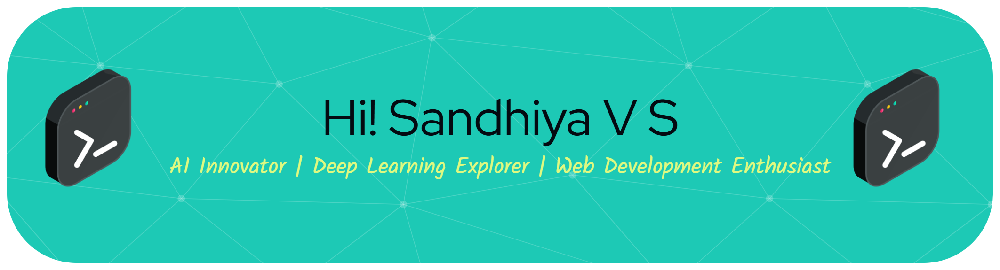

# Welcome to My GitHub Profile!  
I'm V.S. Sandhiya, an enthusiastic AI and Machine Learning student at Kalaignarkarunanidhi Institute of Technology, Coimbatore, with a passion for transforming creative ideas into impactful, real-world projects. I love exploring the intersection of intelligence and innovation, building solutions that are both technically strong and user-focused. My uniqueness lies in my ability to blend creativity with analytical thinking, crafting clean, efficient code while ensuring clarity and purpose in everything I build. Skilled in Python, C, HTML, CSS, JavaScript, Scikit-learn, NumPy, Pandas, and Streamlit, I enjoy developing intelligent systems that make a difference — like my current project, a Smart Conversational AI with Wearable Health Monitoring System that integrates real-time health tracking with AI-driven insights. I believe in continuous learning, collaboration, and building technology that inspires, informs, and innovates.

---

## AI Innovator | Vibe Coder | Algorithm Enthusiast

# About Me

<table>
  <tr>
    <td width="50%" valign="top">

## Profile

- **3rd Year B.E. CSE (AI & ML)** student at **KIT – Kalaignar Karunanidhi Institute of Technology, Coimbatore, 641402.**  
- Passionate about **Artificial Intelligence, Machine Learning, Data Science**, and **Full-Stack Development.**  
- **Winner of IIT Madras – TN Hackathon X (NCSRC) 2025**, recognized for innovation and problem-solving excellence.  
- Currently developing a **Smart Conversational AI with Wearable Health Monitoring System** integrating real-time analytics and AI-driven health insights.  
- Skilled in Python, DSA, OOPs, DBMS, IOT with a passion for creating intelligent, innovative, and user-focused solutions.

</td>
    <td width="50%" valign="top">
      

</td>
  </tr>
</table>

### Let's build something amazing together! 

---

## Tech Stack  

---

### Databases & Tools

  
  
  
  
  
  
  

### Frameworks & Libraries

  
  
  

### Vibe Coding Tools

  
  
  
  
  
  
  
  

---

##  Competitive Programming Profiles

<table>
<tr>
<td width="50%" valign="top">

###  LeetCode Profile

 

**Achievements**
- Specialized in **Dynamic Programming, Arrays, and Strings**
- Maintains an **active solving streak**
- **Consistent contributor** to coding challenges

</td>

<td width="50%" valign="top">

###  CodeChef Profile

<table align="center">
  <tr>
    <td align="center" colspan="2">
      
    </td>
  </tr>
  <tr>
    <td align="center">
      
    </td>
    <td align="center">
      
    </td>
  </tr>
  <tr>
    <td align="center">
      
    </td>
    <td align="center">
      
    </td>
  </tr>
  <tr>
    <td align="center" colspan="2">
      
    </td>
  </tr>
</table>

 

**Achievements**
- Solved **420+ Problems**
- **Peak Rating:** 1510  
- **45 Contests** Participated  
- **160+ Active Days**

</td>
</tr>
</table>

---

Keep coding, keep growing! 💻

---

#  Project Showcase  

<table>  
<tr>  
<td>  

####  **Predicting Neonatal Diseases**  
> *AI-Powered Health Prediction System*  

** Rating:** ★★★★★ (Top Rated Project)  

Developed an intelligent neonatal health prediction model that identifies and classifies risks such as *Respiratory Issues, Jaundice,* and *Infections* in newborns.  
This system combines AI-based health monitoring and medical analytics to deliver reliable insights for early diagnosis.  

**Highlights:**  
-  Multi-class risk prediction (No Risk, Respiratory, Jaundice, Infection)  
-  Real-time dashboard using Streamlit  
-  Automatic PDF report generation  
-  AI Voice Assistant for medical guidance  
-  Explainable AI (SHAP-based insights)  

**Tech Stack:** Python, Scikit-learn, Streamlit, Pandas, NumPy, SHAP  

---

####  **Furry Friends – Pet Store & Healthcare Website**  
> *Your one-stop pet care and adoption hub*  

** Rating:** ★★★★☆  

A dynamic web platform offering **pet adoption, healthcare services, and pet food store management.**  
Designed with a visually appealing and user-friendly interface for all pet lovers.  

**Highlights:**  
-  Pet adoption form with image showcase (Dogs, Cats, Rabbits, Birds)  
   Pet healthcare and food store services  
-  Contact form and “About Us” section  
-  Styled using cascading CSS effects and image-based backgrounds  

**Tech Stack:** HTML, CSS, JavaScript  

---

####  **Hand Gesture Recognition System**  
> *AI-Based Human-Computer Interaction Project*  

** Rating:** ★★★★☆  

A computer vision-based project that detects and interprets hand gestures in real-time.  
Enables intuitive control systems and can be expanded for accessibility tools.  

**Highlights:**  
-  Real-time gesture recognition using OpenCV  
-  Integrated camera input and preprocessing  
-  Gesture-based control for user interface  

**Tech Stack:** Python, OpenCV, Mediapipe  

---

####  **Pet Adoption Management System**  
> *Streamlined Pet Adoption Process using Web Technology*  

** Rating:** ★★★☆☆  

A simple web-based system that helps manage pet adoption requests efficiently.  
Focused on providing a digital platform for shelters to list and track adoptions.  

**Highlights:**  
-  Adoption form with user data validation  
-  Pet profiles with breed details and availability  
-  Responsive design with basic navigation  

**Tech Stack:** HTML, CSS, JavaScript  

</td>  
</tr>  
</table>  

---

#  Certifications & Achievements

##  Competition Honors

<table>
<tr>
<td width="50%">

###  IIT Madras TN Hackathon X 2025
**3rd Prize Winner**
> *IIT Madras - NCSRC*

Secured 3rd position among top innovators in a prestigious state-level hackathon organized by IIT Madras National Cyber Security Research Centre.

</td>
<td width="50%">

###  TANCAM 3DEXPERIENCE Hackathon
**2nd Place - Tamil Nadu Women's Hackathon 2025 **
> *TIDCO Tamil Nadu Centre of Excellence for Advanced Manufacturing – Dassault Systèmes 3DEXPERIENCE Lab*

Secured 2nd place in the Tamil Nadu Women's Hackathon 2025, organized by TNSWC and powered by TIDCO & Dassault Systèmes 3DEXPERIENCE Lab.  
A proud and empowering achievement as a woman in technology, showcasing innovation, technical excellence, and problem-solving skills in the field of advanced manufacturing and AI solutions.

</td>
</tr>
</table>

---

##  Professional Certifications

|  Certification |  Issuing Organization |  Specialization |
|:-----------------|:------------------------|:------------------|
| **Design Thinking** | NPTEL | **Elite** Grade |
| **Foundations of AI** | Coursera | AI/ML Engineering |
| **Machine Learning with Python** | IBM | Data Science & ML |

---

###  *Continuously learning and pushing boundaries in technology*

---

### GitHub Contribution Snake  

  <picture>
    <source media="(prefers-color-scheme: dark)" srcset="https://raw.githubusercontent.com/TecqHarishKrish/TecqHarishKrish/output/github-snake-dark.svg" />
    <source media="(prefers-color-scheme: light)" srcset="https://raw.githubusercontent.com/TecqHarishKrish/TecqHarishKrish/output/github-snake.svg" />
    
  </picture>

---

> "Innovation distinguishes between a leader and a follower." – Steve Jobs  

⭐ Feel free to explore my repositories and don't forget to star if you find something interesting! ⭐  

---

**Last Updated: November 2025**

  

  

  

 

  

<table>
<tr>
<td width="50%" valign="top">

## 🤝 Let's Connect!

<table>
  <tr>
    <td align="center" width="150">
      
       
      <b>LinkedIn</b>
       
      Professional Network
    </td>
    <td align="center" width="150">
      
       
      <b>GitHub</b>
       
      Code Repository
    </td>
    <td align="center" width="150">
      
       
      <b>Gmail</b>
       
      Direct Contact
    </td>
    <td align="center" width="150">
      
       
      <b>CodeChef</b>
       
      Competitive Coding
    </td>
    <td align="center" width="150">
      
       
      <b>LeetCode</b>
       
      Problem Solving
    </td>
  </tr>
</table>

 

---

